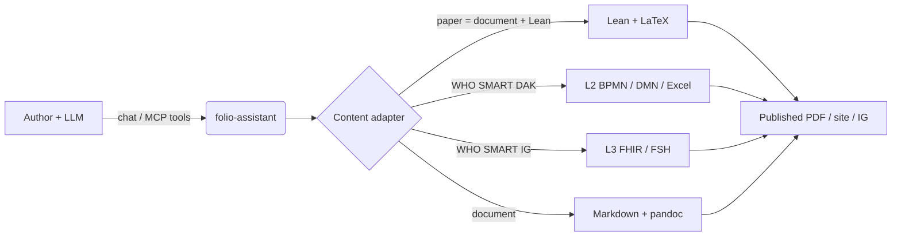
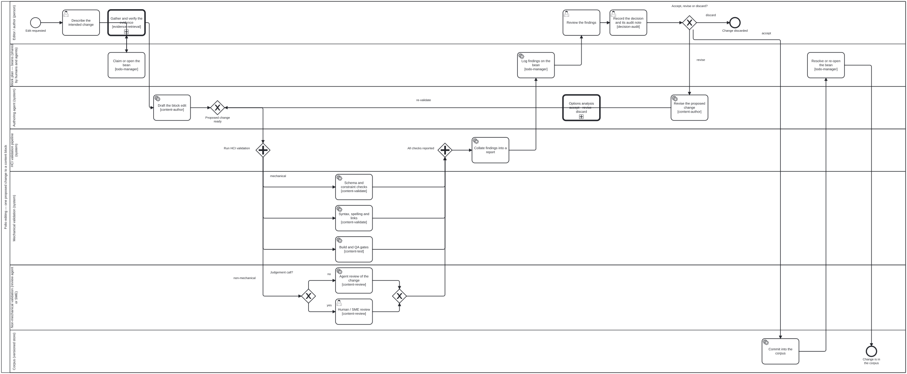
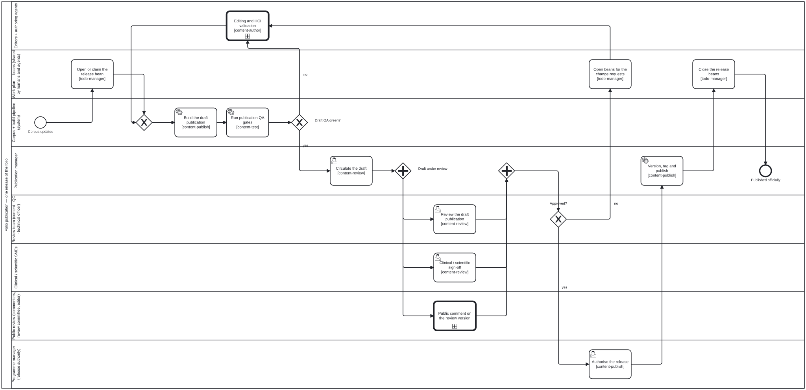
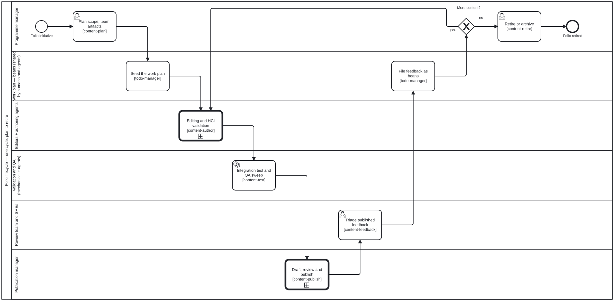

# cat-harness

**The harness layer.** Everything an agent needs in order to work — the
knowledge graph of skills, the BPMN processes they run inside, the roles that
own the swimlanes, the schemas that declare all of it, the MCP server that
serves it, and the published documentation site.

It is a *layer*, not a repository of its own: whichever repository checks it
out holds it beside other layers, and that repository's root `README.md`
indexes them. It is not linked from here, because this layer may not point up
the dependency arrow to what includes it.

**Contents**

<!-- readme:toc:begin -->

- [What is in here](#what-is-in-here)
- [Reading it as a person, or as an agent](#reading-it-as-a-person-or-as-an-agent)
- [What it does](#what-it-does)
- [Bootstrapping — setting up a repository to write in](#bootstrapping--setting-up-a-repository-to-write-in)
- [How a change gets published](#how-a-change-gets-published)
- [Start a new folio](#start-a-new-folio)
- [Running it](#running-it)
  - [The tools the agent gets](#the-tools-the-agent-gets)
- [Documentation](#documentation)

<!-- readme:toc:end -->

## What is in here

The authoritative list is [`cat-harness.json`](cat-harness.json) — every directory this
instance declares, and the kind of graph each one holds. Read it rather than a
list in this file: a list here would be a second answer, free to disagree with
the first the day a directory moves. Four entries are worth naming because a
reader looks for them by name:

| | |
|---|---|
| [`skills/`](skills/) | the instruction bodies — ask for one with `skill_list` / `skill_fetch` rather than opening a path |
| [`processes/`](processes/) | the BPMN processes; the diagrams are executable, not illustrations |
| [`schemas/`](schemas/) | the Zod declarations every checker reads, `cat-harness.ts` first |
| [`docs/`](docs/) | the Jekyll site, published at <https://litlfred.github.io/folio-assistant/> |

## Reading it as a person, or as an agent

Both entries exist and they are different files on purpose:

- **A person** starts here, then the
  [documentation site](https://litlfred.github.io/folio-assistant/) —
  [installation](https://litlfred.github.io/folio-assistant/docs/cat-harness/start/installation.html),
  [getting started](https://litlfred.github.io/folio-assistant/docs/cat-harness/start/getting-started.html),
  [architecture](https://litlfred.github.io/folio-assistant/docs/cat-harness/concepts/architecture.html).
- **An agent** starts at [`AGENTS.md`](AGENTS.md), which does not restate this
  file. It carries what a cold agent has to *do* — the order of operations,
  which store answers which question, and the rules that bind before the first
  edit.

## What it does

**A content-agnostic agent skills framework.** Author rigorous content with an
LLM — documents and policy guidance, scientific papers and books, WHO SMART
Guidelines, and FHIR Implementation Guides — backed by an optional MCP server,
a typed content-object model, and a per-content-type skill system.



| Content type | Artifacts | Skill package |
|--------------|-----------|---------------|
| **Documents & policy guidance** | Markdown → HTML/PDF (no TeX) | `folio-document-adapter` |
| **Scientific papers & books** | Lean 4 + LaTeX/Markdown | `authoring-math` |
| **WHO SMART Guidelines DAKs (L2)** | BPMN, DMN, Excel, terminology | `authoring-who-smart-guidelines` |
| **WHO SMART Implementation Guides (L3)** | FHIR / FSH / IG Publisher | `authoring-who-smart-guidelines` |
| **Others** | pluggable adapter + skill package | _add your own_ |

> **A paper is a document plus Lean.** The two share one content model, one
> editorial graph, one QA system and one publication pipeline; a paper adds the
> block kinds whose assertion is a formal mathematical claim, and the two
> toolchains that serve them. So the `paper` adapter *extends* the `document`
> adapter rather than sitting beside it, and a document folio needs neither
> Lean nor a TeX installation to publish.

## Bootstrapping — setting up a repository to write in

**`bootstrap litlfred/cat-harness`** means *set this repository up the same way
that one is set up.* A repository that has been bootstrapped carries a small
file saying what kind of thing it holds and where to find the procedures for
working on it — how to draft, how to check, how to publish. Those procedures
are a **harness**, and they live in their own repository rather than being
copied in. You give one repository name; what kind of document, which
procedures and which editorial style are all read from **that** repository's
setup file, so there is nothing else to ask.

An agent pointed at a repository that is not set up yet starts at
[bootstrap's README](https://github.com/litlfred/bootstrap#readme), written for
someone who knows none of the above. Why it is built this way, and the
questions still open: [`docs/proposals/bootstrap.md`](docs/proposals/bootstrap.md)
— kept and addressable, deliberately not published as a page.

## How a change gets published

The editing and publication processes are **BPMN 2.0 swimlane diagrams**, and
they are executable rather than illustrations; the pictures are generated from
them by `bun run cat render:bpmn`. The full walk-through, with the roles and the
skill each activity uses, is the
**[publication workflow](docs/process/publication-workflow.md)**
([published](https://litlfred.github.io/folio-assistant/docs/cat-harness/process/publication-workflow.html)).

**One proposed change to one content block — the HCI validation gate.** An
authoring agent produces a **proposed** change, never a commit. It fans out
through **mechanical** validation (schema, syntax, spelling, links, build and
QA gates) and **non-mechanical** validation (a review agent, escalating to a
human or SME on a judgement call). Both must report; the findings are shown to
the editor; only an accepted change is written to the corpus.



**Corpus → draft → review team → published.**



**One cycle of a folio, plan → retire.** Both diagrams above appear here as call
activities, and the **work plan (beans)** lane runs through all three —
claimed before work starts, updated with findings, resolved on commit — so a
human and an agent read the same answer to *what is done, and what is next*.



Per content type: [document](docs/assets/img/workflows/authoring-a-document.svg) ·
[paper](docs/assets/img/workflows/authoring-a-paper.svg) ·
[WHO SMART DAK (L2)](docs/assets/img/workflows/l2-dak-authoring.svg) ·
[WHO SMART IG (L3)](docs/assets/img/workflows/l3-fhir-pipeline.svg). Their
`.bpmn` sources belong to the content layers that own each process.

## Start a new folio

A **folio** is your content repository — the paper, the guidance note, the
guideline; this is the platform it uses. `bun run cat init-folio --help`, or the
`folio_init` tool, scaffolds one: the manifests, `<name>.config.json` selecting
the adapter, `AGENTS.md` with its `CLAUDE.md` / `GEMINI.md` stubs, `.mcp.json`,
the session-start hook and the work plan — and nothing that is subject matter.
`--dry-run` shows what it would write, and re-running never overwrites your
edits unless you pass `--force`. Then **open your agent in the folio, not
here**, and ask it to *add a chapter*.

| You are writing | `--type` | Needs |
|---|---|---|
| Policy guidance, a standard, a report, a handbook | `document` | Bun; pandoc to render |
| A paper or book with machine-checked mathematics | `paper` | + Lean 4 (elan) and TeX Live |

Choose `document` unless the folio will actually carry formal mathematics —
`paper` adds two large toolchains. Full walk-throughs:
[writing a document](docs/guides/writing-a-document.md) ·
[writing a paper](docs/guides/writing-a-paper.md).

## Running it

Every command runs from the **checkout root**, not from here, as
`bun run cat <script>` — the runner finds the script in whichever layer
declares it under `checkoutScripts` in its `package.json`.

```sh
bun install                                     # once, at the checkout root
bun run cat gates                               # EVERY fast gate CI runs — before you push
bun run cat gates --all                         # ...plus the browser jobs
bun run cat start                               # run the assistant (stdio MCP)
bun run cat start:http                          # ...or over HTTP
bun run cat check-deps                          # probe environment capabilities (LaTeX, Lean, …)
bun test                                        # unit tests
bun run cat test:e2e                            # Playwright end-to-end tests
bun run cat lint                                # eslint
bun run cat init-folio --help                   # scaffold a new folio
bun run cat readme:sync                         # refresh a README's generated sections (readme:sync:check for CI)
bun run cat readme:sections                     # list the sections a README can opt into
bun run cat readme:audit                        # verify a README's links still resolve
bun run cat index:render                        # write an index checkout's root AGENTS.md, README.md and stubs
bun run cat preview:site                        # BUILD the docs site locally and look at a page
bun run cat bat:sync                            # the Windows .bat wrapper beside each user-run .sh (bat:sync:check for CI)
bun run cat-harness-tools/scripts/gen-schema-docs.ts  # regenerate the schema reference
bun run cat-harness-tools/scripts/gen-skill-docs.ts   # regenerate the skill-instruction reference
```

**Connecting an LLM harness.** The assistant is an MCP server, launched over
**stdio**: `.mcp.json` in a folio wires it for Claude Code, Gemini CLI,
Antigravity or any other MCP client, and the `SessionStart` hook runs
`scripts/session-start-coord-sweep.sh` so each session is primed with the work
plan; `work_plan_prime` gives any connected agent the same priming. Per-harness
instructions: [installation](docs/start/installation.md).

### The tools the agent gets

| Tool | Purpose |
|------|---------|
| `folio_init` | Scaffold a new folio (runs before a folio has a content type) |
| `work_plan_prime` | Surface the work-plan (beans) |
| `check_dependencies` | Probe installed toolchains |
| `skill_list` / `skill_fetch` | Discover + load skills |
| `content_list` / `content_validate` / `content_build` | Lifecycle over the folio |
| `content_profile_check` | Enforce the folio's declared profile (no math kinds or Lean in a document) |
| `document_render_md` / `document_render_html` / `document_render_pdf` | Render without TeX (both content types) |
| `paper_render_pdf` / `paper_render_html` / `paper_preview` / `formula_render` | Render via LaTeX (paper adapter) |
| `lean_setup` / `lean_build` / `lean_check` / `lean_status` | Lean lifecycle (paper adapter) |
| `paper_preferences` | Per-folio rendering preferences |

## Documentation

| Page | What |
|------|------|
| [Installation](https://litlfred.github.io/folio-assistant/docs/cat-harness/start/installation.html) | prerequisites, harness setup |
| [Getting started](https://litlfred.github.io/folio-assistant/docs/cat-harness/start/getting-started.html) | first skill run |
| [Tutorial: writing a document](https://litlfred.github.io/folio-assistant/docs/cat-harness/guides/writing-a-document.html) | prose folios — policy guidance, standards, reports |
| [Tutorial: writing a paper](https://litlfred.github.io/folio-assistant/docs/cat-harness/guides/writing-a-paper.html) | LLM-driven walk-through with a mock session |
| [Content types](https://litlfred.github.io/folio-assistant/docs/cat-harness/concepts/content-types.html) | the authoring formalism per domain |
| [Skills & roles](https://litlfred.github.io/folio-assistant/docs/cat-harness/concepts/skills.html) | all skills + roles, and how they work with the LLM |
| [Skill schema reference](https://litlfred.github.io/folio-assistant/reference/skills/) | generated input/output contracts |
| [TypeScript API reference](https://litlfred.github.io/folio-assistant/api/) | the content-object model |
| [Architecture](https://litlfred.github.io/folio-assistant/docs/cat-harness/concepts/architecture.html) | adapters, MCP, RBAC, blocks |
| [Contributing](https://litlfred.github.io/folio-assistant/docs/cat-harness/start/contributing.html) | run `bun test` and `bun run cat lint` before pushing |

---

*Most of what this README says from "What it does" onwards was the checkout
root's README until 2026-10-09, when that file became a rendered index of the
instances (`bun run cat index:render`); the original is kept verbatim on the
`fsh-guts` state branch (`separated/root-README.md`).*

*`README.md` and [`AGENTS.md`](AGENTS.md) are declared assets of this instance
([`cat-harness.json`](cat-harness.json), roles `instance-readme` and
`agent-instructions`). Until 2026-09-20 this instance declared the
**repository's** two files as its own, so the file a reader opened first
answered "what is this repository" and "what is this layer" at once, and
`check:subgraph-coverage` reported nothing because the asset did resolve — to
the wrong file's job. Issue #592.*
