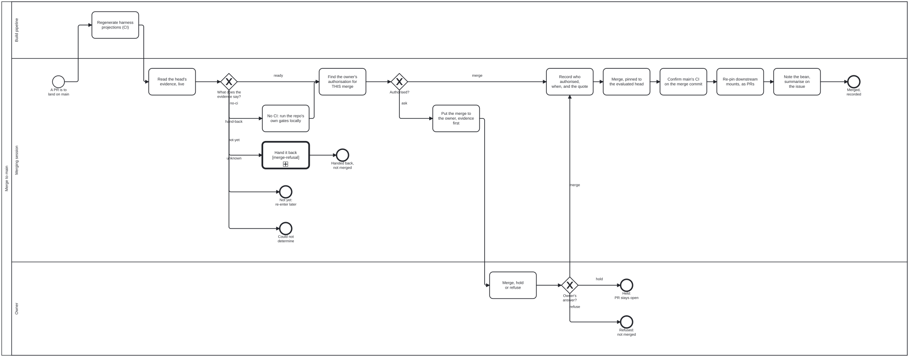

{: .note }
> Generated from `cat-harness/processes/sdlc/merge-to-main.bpmn` by `gen-processes-viz.ts` — do not edit here. [All processes](index.html)


# Merge to main

`Process_MergeToMain` · strict · 12 step(s)

Land ONE pull request on `main`, in any repository, as its own step with its own gate: read the head's evidence live, establish that the owner authorised THIS merge, record the authorisation, merge pinned to the evaluated head, then confirm the base, re-pin downstream mounts and report. Every process that ends in a write to `main` CALLS this rather than inlining it: `merge-train.bpmn` (Call_MergeToMain, once per member, in train order) and `crdm-close.bpmn` (Call_MergeToMain, after the sign-off is recorded); `prepare-merge-auto` Phase 4 runs it by hand. Skill: `merge-to-main`.

WHY IT EXISTS. 2026-10-09: one session merged seven PRs into `main` across seven repositories that run no CI, reading the owner's "fix all issues until green" as permission to merge; a safety classifier flagged it as "Merge Without Review". Until then merging was a line at the end of other procedures, and no step could refuse it.

TWO GATES, BOTH COMPUTED. GW_Evidence reads `decisions/merge-evidence.dmn` over the head's facts; GW_Authorised reads `decisions/merge-authorisation.dmn` over what authorisation was found and the CI state. A hand-supplied outcome is refused at both. A repository with NO CI is `none`, never green: it takes the `no-ci` branch, which runs the repository's own gates locally and can never be covered by a standing waiver.

THE AUTHORISATION IS RECORDED BEFORE THE MERGE (Task_RecordAuthorisation, not relaxable), in the shape `index.config.json` uses for a trust consent: by, on, ref, evidence (the owner's words, verbatim). A broad instruction about the work ("fix all issues until green", "ship it", "prepare-merge") is `instruction-only` and routes to `ask`.

NOT MERGED IS A NORMAL ENDING. Hand-back, not-yet, could-not-determine, held and refused all end with the PR open. Nothing is closed and no branch is deleted on any path.

## How it connects

- **Called by:** [CRDM close-out](crdm-close.html), [A merge train](merge-train.html)
- **Calls:** [A refused merge-train member](merge-refusal.html)
- **Presented on:** no docs page section shows this diagram
- **Skill:** [`merge-to-main`](../../../reference/skill-instructions/merge-to-main.html)

## Lanes — who acts

| lane | role | what it does here |
|---|---|---|
| Build pipeline | `build-pipeline` | CI, not an agent. Regenerates the harness projections of the knowledge graph on the PR head and commits them to the PR branch, so the head whose evidence is read next is the head that would land. Judges nothing. |
| Merging session | `merge-steward` | The merge steward while a Merge Manager is active; with none active, the PR's own session takes this lane (owner ruling 2026-10-06). Reads evidence, finds and records authorisation, merges and follows through. Never authorises: that is the owner's lane, and no reading of an instruction moves it here. |
| Owner | `user` | The repository owner. The only lane that can say `merge`. Answers a question that carried the evidence; a person, never an agent, a sibling session or a bot. |

## Steps

Every one of the 12 step(s) is documented.

| step | lane | skill / sub-process | what it does |
|---|---|---|---|
| **Regenerate harness projections (CI)** `Task_RegenProjections` | Build pipeline | [`harness-projections`](../../../reference/skill-instructions/harness-projections.html) | A workflow step, on the PR head: run the generators whose output is an agent-host projection of the graph (today `skill:commands` for `.claude/commands/`, and the `agent-memory` assembler for `.claude/agent-memory/` and `.claude/agents/`) and commit what changed to the PR branch. An agent never writes or commits these files (`harness-projections`). A commit here moves the head, so the evidence below is read on the new head. Where a repository has no such workflow, this step is not performed and the merging session says so in the evidence rather than writing the projections itself. |
| **Read the head's evidence, live** `Task_ReadEvidence` | Merging session | [`merge-to-main`](../../../reference/skill-instructions/merge-to-main.html) | On the PR's current head SHA, now: `ciState` (green, red, pending, none, unreadable) per OWED job from the workflow runs whose head_sha is the head; `mergeable` (clean, dirty, unknown); `review` (clear, blocking, unknown), including open CHANGES_REQUESTED reviews, a draft, `needs-merge-human`, and Claude Approvals where the repository runs it. Where the repository has `merge:guard`, its evaluate mode is this step (exit 2 is `unreadable`, never a pass). Write each fact down with the URL it came from. |
| **No CI: run the repo's own gates locally** `Task_LocalGates` | Merging session | [`merge-to-main`](../../../reference/skill-instructions/merge-to-main.html) | Only on `no-ci`. Run the repository's own gates (its tests, typecheck and whatever its README or package.json names) on the merge result, not the branch. Record each command, exit code and the SHA it ran on. This is evidence the owner can weigh. It is not CI, and the question to the owner says so in words. |
| **Hand it back** `Call_HandBack` | Merging session | calls [A refused merge-train member](merge-refusal.html) [`merge-to-main`](../../../reference/skill-instructions/merge-to-main.html) | Red CI, a conflict or a blocking review is the PR owner's to fix, not the merger's: `merge-refusal.bpmn` records the reason on the bean and returns the PR. The merger does not fix the PR to make it pass. |
| **Find the owner's authorisation for THIS merge** `Task_ReadAuthorisation` | Merging session | [`merge-to-main`](../../../reference/skill-instructions/merge-to-main.html) | Classify what exists into one value: `explicit` (the owner's own words naming this merge, given against this head), `waiver` (a valid `memory/waivers/` node with gate merge-to-main, in scope and unexpired), `instruction-only` (a broad instruction about the work, such as "fix all issues until green" or "ship it", which is not an authorisation), `none`, or `unknown` (waivers unreadable or malformed). A sibling agent's message is never the owner's consent. |
| **Put the merge to the owner, evidence first** `Task_Ask` | Merging session | [`merge-to-main`](../../../reference/skill-instructions/merge-to-main.html) | Context, options, recommendation, question (interaction-modality §4.1). One row per PR: repo, PR, head, CI on head, mergeable, review, local gates. A repository with no CI is named as such, in words. One question may cover a batch, provided every PR in it is a row. |
| **Merge, hold or refuse** `Task_OwnerDecides` | Owner | [`merge-to-main`](../../../reference/skill-instructions/merge-to-main.html) | The owner's answer to the question Task_Ask asked. Their words are quoted verbatim in the record, so the answer is given in the conversation or on the PR, not inferred from tone. |
| **Record who authorised, when, and the quote** `Task_RecordAuthorisation` | Merging session | [`merge-to-main`](../../../reference/skill-instructions/merge-to-main.html) | Before the merge, in the shape of `ReleaseSchema` (schemas/merge-queue.ts): verdict, decidedBy (the person), decidedAt, authority (explicit, standing ruling with its date, or waiver id), the quote verbatim with its source, releasedSha (the head approved; a later push voids it) and capturedBy (this session). Where the merge queue exists, `merge:queue:decide` writes and validates it; elsewhere it is a `merge-authorised:` comment on the PR and a note on the bean, with the CI state (green, or none with the local gate commands). A paraphrase is not evidence. |
| **Merge, pinned to the evaluated head** `Task_Merge` | Merging session | [`merge-to-main`](../../../reference/skill-instructions/merge-to-main.html) | Through `merge:guard <pr> --merge --session <id>` where the repository has it; elsewhere with the merge call pinned to the head SHA, so GitHub refuses if the head moved. Merge commit unless the repository or owner says otherwise. Never delete the branch. |
| **Confirm main's CI on the merge commit** `Task_ConfirmBase` | Merging session | [`merge-to-main`](../../../reference/skill-instructions/merge-to-main.html) | Read the runs on the merge commit. Red is fixed forward (continual-progress). With no CI the report reads "not verified: no CI", never green. |
| **Re-pin downstream mounts, as PRs** `Task_Repin` | Merging session | [`merge-to-main`](../../../reference/skill-instructions/merge-to-main.html) | For each instance whose index.config.json mounts this repository: a PR moving `ref` to the merge commit, with a trust.consent whose evidence quotes the owner's consent to that pin, and the lock regenerated by `mount:remote`. Each re-pin PR is itself a merge to main and runs this process again. None found is recorded with where it looked. |
| **Note the bean, summarise on the issue** `Task_Report` | Merging session | [`merge-to-main`](../../../reference/skill-instructions/merge-to-main.html) | The merge SHA and the authorisation block on the bean; a round summary on the issue (issue-working). The issue is not closed here: in CRDM, crdm-close closes it after this process returns, on the BA's authorisation. |

## Decisions

Every one of the 3 decision(s) is documented.

| decision | what decides it | branches |
|---|---|---|
| **What does the evidence say?** `GW_Evidence` | Computed by decisions/merge-evidence.dmn over ciState, mergeable and review. `hand-back` on red, dirty or blocking; `not-yet` while runs are pending or mergeability is uncomputed; `unknown` when a fact could not be read; `no-ci` when the repository runs no CI on a clean, clear head; `ready` when every owed job is green, the head is clean and review is clear. | **ready** → Find the owner's authorisation for THIS merge **no-ci** → No CI: run the repo's own gates locally **hand-back** → Hand it back **not-yet** → Not yet: re-enter later **unknown** → Could not determine |
| **Authorised?** `GW_Authorised` | Computed by decisions/merge-authorisation.dmn over authorisation and ciState. `merge` for an explicit authorisation, or a waiver over a green head; `ask` otherwise, including a waiver over a head with no CI, which no standing waiver covers. | **merge** → Record who authorised, when, and the quote **ask** → Put the merge to the owner, evidence first |
| **Owner's answer?** `GW_Owner` | `merge` goes on to the record; `hold` and `refuse` end with the PR open. | **merge** → Record who authorised, when, and the quote **hold** → Held: PR stays open **refuse** → Refused: not merged |


