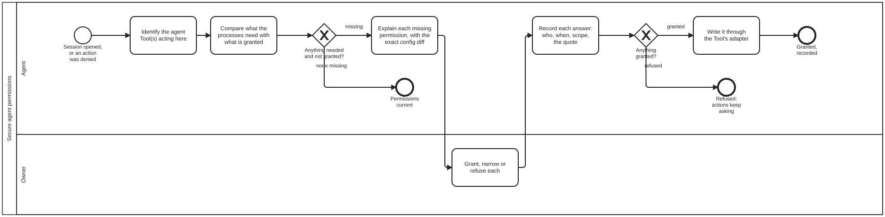

{: .note }
> Generated from `cat-harness/processes/process/secure-agent-permissions.bpmn` by `gen-processes-viz.ts` — do not edit here. [All processes](index.html)


# Secure agent permissions

`Process_SecureAgentPermissions` · strict · 6 step(s)

Secure the permissions a coding agent needs to take part in this harness's processes, from the human who can grant them, and write each grant into the agent Tool's own configuration through that Tool's adapter. VENDOR-NEUTRAL: the coding agent is a Tool, and Claude Code is one of several (Gemini CLI, Cursor, Copilot, Codex). Nothing in this diagram names a vendor's file; the adapter for the Tool in use does. Skill: `agent-permissions`.

CALLED FROM SESSION START (`session-state-machine.bpmn`, Call_SecurePermissions, after the session record opens), so it is part of initiating the harness for an actor. It also runs on demand when an agent hits a denied action: the denial is a reason to ask, never to edit the Tool's config itself. A run that finds every needed permission already granted and recorded ends at End_Current without asking anything.

NEVER SELF-GRANTED. The grant is the owner's (Task_OwnerGrants, a person only) and the config write is done by the person, or by the agent with their explicit consent to that exact diff. An agent that edits its own permission configuration is self-modification; an auto-mode classifier blocked exactly that on 2026-10-09, when an agent tried to edit `.claude/settings.json`.

MERGE IS NOT A GRANTABLE PERMISSION HERE. Merging to main stays a separate owner-authorised step on every occasion (`merge-to-main.bpmn`); this process never writes an allow-rule for it.

## How it connects

- **Called by:** [Session state machine](session-state-machine.html)
- **Calls:** none
- **Presented on:** no docs page section shows this diagram

## Lanes — who acts

| lane | role | what it does here |
|---|---|---|
| Agent | `authoring-agent` | Finds out which agent Tool is acting, what the harness's processes need it to be allowed to do, and what is already granted; explains each missing permission; records and applies what the owner granted. Grants nothing to itself. |
| Owner | `user` | Grants, narrows or refuses each permission, having been told what it allows and why. The only lane that can grant. |

## Steps

Every one of the 6 step(s) is documented.

| step | lane | skill / sub-process | what it does |
|---|---|---|---|
| **Identify the agent Tool(s) acting here** `Task_IdentifyTools` | Agent | [`agent-permissions`](../../../reference/skill-instructions/agent-permissions.html) | Which coding-agent Tool is running this session, and which others the instance is configured for (each has its own config files: AGENTS.md is read by many; Claude Code, Gemini CLI, Cursor, Copilot and Codex each add their own). The Tool's adapter says where its permissions live and how a rule is written. A Tool with no adapter is reported, and its permissions are left to the person. |
| **Compare what the processes need with what is granted** `Task_ReadGrants` | Agent | [`agent-permissions`](../../../reference/skill-instructions/agent-permissions.html) | The needed set is the agent-permissions skill's list (write generated projections: CI only, never the agent; edit hooks or settings; run the gates; push a feature branch; open a PR), scoped to what this instance's processes actually call. The granted set is the recorded grants plus the Tool's current config, read through its adapter. A config rule with no recorded grant is reported as unrecorded, not treated as granted. |
| **Explain each missing permission, with the exact config diff** `Task_Explain` | Agent | [`agent-permissions`](../../../reference/skill-instructions/agent-permissions.html) | Per permission: what it allows the agent to do without asking, why a process here needs it, the narrowest form that would do, and the exact change to the Tool's config. Context, options, recommendation, question (interaction-modality §4.1). Least privilege is the recommendation unless there is a measured reason for more. |
| **Grant, narrow or refuse each** `Task_OwnerGrants` | Owner | [`agent-permissions`](../../../reference/skill-instructions/agent-permissions.html) | The owner's answer, per permission, in their own words. Quoted verbatim in the record. |
| **Record each answer: who, when, scope, the quote** `Task_RecordGrant` | Agent | [`agent-permissions`](../../../reference/skill-instructions/agent-permissions.html) | One record per permission: by, on, tool, permission, scope (session, instance, or until a date), the config diff, and evidence (the owner's words verbatim, with where they were said). Refusals are recorded the same way. |
| **Write it through the Tool's adapter** `Task_WriteConfig` | Agent | [`agent-permissions`](../../../reference/skill-instructions/agent-permissions.html) | The exact diff the owner saw, nothing more, written by the person or by the agent under their consent to that diff. Hand-edited agent config only; generated projections are CI's (harness-projections). |

## Decisions

Every one of the 2 decision(s) is documented.

| decision | what decides it | branches |
|---|---|---|
| **Anything needed and not granted?** `GW_Gap` | `none missing` when every needed permission has a recorded grant reflected in the Tool's config; `missing` otherwise, including a rule present in the config with no grant on the record. | **none missing** → Permissions current **missing** → Explain each missing permission, with the exact config diff |
| **Anything granted?** `GW_Granted` | `granted` when the owner granted at least one permission (as asked or narrowed); `refused` when they granted none. Read after the record, so a refusal is on the record too and the next session does not ask the same question blind. | **refused** → Refused: actions keep asking **granted** → Write it through the Tool's adapter |


