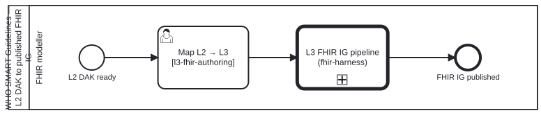

{: .note }
> Generated from `smart-base/processes/content/dak-l3-ig.bpmn` by `gen-processes-viz.ts` — do not edit here. [All processes](index.html)


# L2 DAK to L3 FHIR IG

`Process_DakL3Ig` · advisory · 2 step(s)

How a WHO SMART Guidelines L2 Digital Adaptation Kit becomes a published L3 FHIR Implementation Guide: map the DAK's L2 content to the FHIR artefacts it calls for, then run fhir-harness's generic L3 pipeline (Process_L3Fhir) with that mapping as its source model. Split out of fhir-harness's l3-fhir-pipeline.bpmn on 2026-10-09 (owner, bean veiu item 4): that layer may not know about DAKs, so the WHO L2 → L3 ordering lives here and the generic pipeline is CALLED, not copied. folio-assistant — a WHO SMART Guidelines L2 DAK to its published L3 FHIR IG.
Source of truth: this file. Open it in bpmn.io, Camunda Modeler, or any other
BPMN 2.0 tool. The SVG under docs/assets/img/workflows/ is generated from it
by `bun run render:bpmn` — never hand-edit the SVG.
The <bootstrap.processes:skill> extension on an activity names the folio-assistant skill
that implements it; <cat-harness.processes:bean> marks a step that reads or writes the shared
work plan in beans/.

## How it connects

- **Called by:** no call activity names this process
- **Calls:** [L3 FHIR IG pipeline](l3-fhir-pipeline.html)
- **Presented on:** no docs page section shows this diagram

## Lanes — who acts

| lane | role | what it does here |
|---|---|---|
| FHIR modeller | `fhir-modeller` | One lane, because this diagram adds exactly one step to the generic pipeline: the mapping from the DAK's L2 content. Every lane after it — build, QC, work plan, publication — belongs to Process_L3Fhir, which CallActivity_L3Fhir runs whole. |

## Steps

Every one of the 2 step(s) is documented.

| step | lane | skill / sub-process | what it does |
|---|---|---|---|
| **Map L2 → L3** `Task_MapL2` | FHIR modeller | [`l3-fhir-authoring`](../reference/skill-instructions/l3-fhir-authoring.html) [`l2-dak-authoring`](../reference/skill-instructions/l2-dak-authoring.html) | Each data element becomes a profile, each value set a ValueSet, each decision a PlanDefinition / Library. The DAK's L2 content is l3-fhir-authoring's sourceModel; this step binds l2-dak-authoring beside it, which is where the WHO L2 → L3 ordering lives now that the generic skill names no DAK (smart-* separation stage D, #1767). |
| **L3 FHIR IG pipeline (fhir-harness)** `CallActivity_L3Fhir` | FHIR modeller | calls [L3 FHIR IG pipeline](l3-fhir-pipeline.html) [`l3-fhir-authoring`](../reference/skill-instructions/l3-fhir-authoring.html) | fhir-harness's l3-fhir-pipeline.bpmn, from its StartEvent_ModelReady with the mapping above as the source model: author FSH, SUSHI, validate, QC, IG Publisher, publish. Called, not copied, so a change to the generic pipeline reaches every IG built on it. |


