# UML — cat-harness-tools

Generated by `cat-harness-tools/scripts/gen-uml-overview.ts` — do not edit. Every named sub-graph the `cat-harness-tools` instance declares, one box each, with the node schema kinds found in it.

**Sources (same model):** [PlantUML](https://github.com/litlfred/folio-assistant/blob/main/cat-harness/uml/overview/cat-harness-tools.puml) · [Mermaid](https://github.com/litlfred/folio-assistant/blob/main/cat-harness/uml/overview/cat-harness-tools.mmd) · [Graphviz DOT]({{ '/assets/img/uml/overview/cat-harness-tools.dot' | relative_url }})

  <fieldset class="fa-uml-view-pick">
    <legend>Layout</legend>
    <input type="radio" name="fa-uml-overview_cat_harness_tools" id="fa-uml-overview_cat_harness_tools-portrait" class="fa-uml-pick-portrait" checked><label for="fa-uml-overview_cat_harness_tools-portrait">Portrait</label>
    <input type="radio" name="fa-uml-overview_cat_harness_tools" id="fa-uml-overview_cat_harness_tools-landscape" class="fa-uml-pick-landscape"><label for="fa-uml-overview_cat_harness_tools-landscape">Landscape</label>
    <input type="radio" name="fa-uml-overview_cat_harness_tools" id="fa-uml-overview_cat_harness_tools-interactive" class="fa-uml-pick-interactive"><label for="fa-uml-overview_cat_harness_tools-interactive">Interactive</label>
  </fieldset>
  <figure class="bpmn-figure fa-uml-portrait">
    
  </figure>
  <figure class="bpmn-figure fa-uml-landscape">
    
  </figure>
  

    
The interactive view lays this diagram out in your browser with Graphviz, and needs JavaScript. Without it, pick Portrait or Landscape, or read <a href="{{ '/assets/img/uml/overview/cat-harness-tools.dot' | relative_url }}">the DOT source</a>.

  

| sub-graph | directory | graph typologies | node schema | nodes | cohesion | in | out |
|---|---|---|---|---|---|---|---|
| `cat-harness-tools/cat-harness-tools-adapters` | `cat-harness-tools/adapters` | code | code: *could not determine* | *not measured* | | | |
| `cat-harness-tools/cat-harness-tools-schemas` | `cat-harness-tools/schemas` | code | code: *could not determine* | *not measured* | | | |
| `cat-harness-tools/cat-harness-tools-scripts` | `cat-harness-tools/scripts` | code | code: *could not determine* | *not measured* | | | |
| `cat-harness-tools/cat-harness-tools-id-lookup` | `cat-harness-tools/id-lookup` | code | code: *could not determine* | *not measured* | | | |
| `cat-harness-tools/cat-harness-tools-tests` | `cat-harness-tools/test` | code | code: *could not determine* | *not measured* | | | |
| `cat-harness-tools/cat-harness-tools-src` | `cat-harness-tools/src` | code | code: *could not determine* | *not measured* | | | |
| `cat-harness-tools/cat-harness-tools-python` | `cat-harness-tools/python` | code | code: *could not determine* | *not measured* | | | |
| `cat-harness-tools/beans` | `cat-harness-tools/beans` | beans | beans: *could not determine* | *not measured* | | | |
| `cat-harness-tools/cat-harness-tools-content` | `cat-harness-tools/content` | code | code: *could not determine* | *not measured* | | | |
| `cat-harness-tools/folio-templates` | `cat-harness-tools/templates` | code | code: *could not determine* | *not measured* | | | |
| `cat-harness-tools/cat-harness-tools-deploy` | `cat-harness-tools/deploy` | code | code: *could not determine* | *not measured* | | | |
| `cat-harness-tools/cat-harness-tools-archimate` | `cat-harness-tools/archimate/scripts` | code | code: *could not determine* | *not measured* | | | |
| `cat-harness-tools/cat-harness-tools-openapi` | `cat-harness-tools/openapi/scripts` | code | code: *could not determine* | *not measured* | | | |
| `cat-harness-tools/health` | `cat-harness-tools/health` | health | `HealthReportSchema` | *not measured* | | | |
| `cat-harness-tools/defs` | `cat-harness-tools/beans/defs` | bean-defs | `BeanKind` | *not measured* | | | |
| `cat-harness-tools/notes` | `cat-harness-tools/beans/notes` | bean-notes | `schema: schemas/bean-note.ts` | *not measured* | | | |
| `cat-harness-tools/workflows` | `cat-harness-tools/beans/workflows` | workflow-state | workflow-state: *could not determine* | *not measured* | | | |

*Nodes, cohesion, in and out* are the detangler's pinned measurements for the same directory (`bun run cat kg:detangle`; skill [`graph-detanglement`](https://github.com/litlfred/folio-assistant/blob/main/cat-harness/skills/kg/graph-management/graph-detanglement.md)). *Not measured* means the detangler does not scan that directory, not that it has no edges.

## Sub-graphs

- [cat-harness-tools/cat-harness-tools-adapters](cat-harness-tools/cat-harness-tools-adapters.html)
- [cat-harness-tools/cat-harness-tools-schemas](cat-harness-tools/cat-harness-tools-schemas.html)
- [cat-harness-tools/cat-harness-tools-scripts](cat-harness-tools/cat-harness-tools-scripts.html)
- [cat-harness-tools/cat-harness-tools-id-lookup](cat-harness-tools/cat-harness-tools-id-lookup.html)
- [cat-harness-tools/cat-harness-tools-tests](cat-harness-tools/cat-harness-tools-tests.html)
- [cat-harness-tools/cat-harness-tools-src](cat-harness-tools/cat-harness-tools-src.html)
- [cat-harness-tools/cat-harness-tools-python](cat-harness-tools/cat-harness-tools-python.html)
- [cat-harness-tools/beans](cat-harness-tools/beans.html)
- [cat-harness-tools/cat-harness-tools-content](cat-harness-tools/cat-harness-tools-content.html)
- [cat-harness-tools/folio-templates](cat-harness-tools/folio-templates.html)
- [cat-harness-tools/cat-harness-tools-deploy](cat-harness-tools/cat-harness-tools-deploy.html)
- [cat-harness-tools/cat-harness-tools-archimate](cat-harness-tools/cat-harness-tools-archimate.html)
- [cat-harness-tools/cat-harness-tools-openapi](cat-harness-tools/cat-harness-tools-openapi.html)
- [cat-harness-tools/health](cat-harness-tools/health.html)
- [cat-harness-tools/defs](cat-harness-tools/defs.html)
- [cat-harness-tools/notes](cat-harness-tools/notes.html)
- [cat-harness-tools/workflows](cat-harness-tools/workflows.html)

## The same model, drawn by Mermaid

Kept so the page renders even where the PlantUML image is missing, and because Mermaid nodes carry the CSS class that colours them from `uml.css`.

```mermaid
classDiagram
  direction LR
  namespace cat_harness_tools__cat_harness_tools_adapters {
    class n_cat_harness_tools_cat_harness_tools_adapters_code["code: no node schema"] {
      <<could not determine>>
    }
  }
  namespace cat_harness_tools__cat_harness_tools_schemas {
    class n_cat_harness_tools_cat_harness_tools_schemas_code["code: no node schema"] {
      <<could not determine>>
    }
  }
  namespace cat_harness_tools__cat_harness_tools_scripts {
    class n_cat_harness_tools_cat_harness_tools_scripts_code["code: no node schema"] {
      <<could not determine>>
    }
  }
  namespace cat_harness_tools__cat_harness_tools_id_lookup {
    class n_cat_harness_tools_cat_harness_tools_id_lookup_code["code: no node schema"] {
      <<could not determine>>
    }
  }
  namespace cat_harness_tools__cat_harness_tools_tests {
    class n_cat_harness_tools_cat_harness_tools_tests_code["code: no node schema"] {
      <<could not determine>>
    }
  }
  namespace cat_harness_tools__cat_harness_tools_src {
    class n_cat_harness_tools_cat_harness_tools_src_code["code: no node schema"] {
      <<could not determine>>
    }
  }
  namespace cat_harness_tools__cat_harness_tools_python {
    class n_cat_harness_tools_cat_harness_tools_python_code["code: no node schema"] {
      <<could not determine>>
    }
  }
  namespace cat_harness_tools__beans {
    class n_cat_harness_tools_beans_beans["beans: no node schema"] {
      <<could not determine>>
    }
  }
  namespace cat_harness_tools__cat_harness_tools_content {
    class n_cat_harness_tools_cat_harness_tools_content_code["code: no node schema"] {
      <<could not determine>>
    }
  }
  namespace cat_harness_tools__folio_templates {
    class n_cat_harness_tools_folio_templates_code["code: no node schema"] {
      <<could not determine>>
    }
  }
  namespace cat_harness_tools__cat_harness_tools_deploy {
    class n_cat_harness_tools_cat_harness_tools_deploy_code["code: no node schema"] {
      <<could not determine>>
    }
  }
  namespace cat_harness_tools__cat_harness_tools_archimate {
    class n_cat_harness_tools_cat_harness_tools_archimate_code["code: no node schema"] {
      <<could not determine>>
    }
  }
  namespace cat_harness_tools__cat_harness_tools_openapi {
    class n_cat_harness_tools_cat_harness_tools_openapi_code["code: no node schema"] {
      <<could not determine>>
    }
  }
  namespace cat_harness_tools__health {
    class cat_harness_tools_health_Threshold["Threshold"] {
      <<json: HealthReportSchema>>
      metric [1] string
      value [1] number
      unit [1] string
      basis [1] string
      severity [1] critical | major | minor
    }
    class cat_harness_tools_health_Measurement["Measurement"] {
      <<json: HealthReportSchema>>
      metric [1] string
      value [1] number
      unit [1] string
      command [1] string
    }
    class cat_harness_tools_health_Finding["Finding"] {
      <<json: HealthReportSchema>>
      summary [1] string
      metric [0..1] string
      severity [1] critical | major | minor
      action [1] string
    }
    class cat_harness_tools_health_Check["Check"] {
      <<json: HealthReportSchema>>
      id [1] string
      state [1] ok | finding | unknown
      summary [1] string
      thresholds [0..*] Threshold[]
      measurements [0..*] Measurement[]
      findings [0..*] Finding[]
      reason [0..1] string
    }
    class cat_harness_tools_health_HealthReport["HealthReport"] {
      <<json: HealthReportSchema>>
      $schema [1] 'health-report/v1'
      producer [1] object
      subject [1] object
      updated_at [1] string
      verdict [1] clean | findings | unknown
      checks [1..*] Check[]
    }
  }
  namespace cat_harness_tools__defs {
    class cat_harness_tools_defs_BeanKind["BeanKind"] {
      <<json: BeanKind>>
      id [0..1] string
      title [0..1] string
      status [0..1] string
      type [0..1] string
      priority [0..1] string
      parent [0..1] string
      blocking [0..*] string[]
      blocked_by [0..*] string[]
      created_at [0..1] string
      updated_at [0..1] string
      tags [0..*] string[]
      issue [0..1] integer | string
      targets [0..1] string[] | string
      $schema [1] string
    }
  }
  namespace cat_harness_tools__notes {
    class cat_harness_tools_notes_bean_notes_shape["bean-notes"] {
      <<schema: schemas/bean-note.ts>>
      fields not machine-readable: schemas/bean-note.ts names no exported schema
    }
  }
  namespace cat_harness_tools__workflows {
    class n_cat_harness_tools_workflows_workflow_state["workflow-state: no node schema"] {
      <<could not determine>>
    }
  }
  cssClass "n_cat_harness_tools_cat_harness_tools_adapters_code" fa_uml_kind_code
  cssClass "n_cat_harness_tools_cat_harness_tools_adapters_code" fa_uml_undetermined
  cssClass "n_cat_harness_tools_cat_harness_tools_schemas_code" fa_uml_kind_code
  cssClass "n_cat_harness_tools_cat_harness_tools_schemas_code" fa_uml_undetermined
  cssClass "n_cat_harness_tools_cat_harness_tools_scripts_code" fa_uml_kind_code
  cssClass "n_cat_harness_tools_cat_harness_tools_scripts_code" fa_uml_undetermined
  cssClass "n_cat_harness_tools_cat_harness_tools_id_lookup_code" fa_uml_kind_code
  cssClass "n_cat_harness_tools_cat_harness_tools_id_lookup_code" fa_uml_undetermined
  cssClass "n_cat_harness_tools_cat_harness_tools_tests_code" fa_uml_kind_code
  cssClass "n_cat_harness_tools_cat_harness_tools_tests_code" fa_uml_undetermined
  cssClass "n_cat_harness_tools_cat_harness_tools_src_code" fa_uml_kind_code
  cssClass "n_cat_harness_tools_cat_harness_tools_src_code" fa_uml_undetermined
  cssClass "n_cat_harness_tools_cat_harness_tools_python_code" fa_uml_kind_code
  cssClass "n_cat_harness_tools_cat_harness_tools_python_code" fa_uml_undetermined
  cssClass "n_cat_harness_tools_beans_beans" fa_uml_kind_beans
  cssClass "n_cat_harness_tools_beans_beans" fa_uml_undetermined
  cssClass "n_cat_harness_tools_cat_harness_tools_content_code" fa_uml_kind_code
  cssClass "n_cat_harness_tools_cat_harness_tools_content_code" fa_uml_undetermined
  cssClass "n_cat_harness_tools_folio_templates_code" fa_uml_kind_code
  cssClass "n_cat_harness_tools_folio_templates_code" fa_uml_undetermined
  cssClass "n_cat_harness_tools_cat_harness_tools_deploy_code" fa_uml_kind_code
  cssClass "n_cat_harness_tools_cat_harness_tools_deploy_code" fa_uml_undetermined
  cssClass "n_cat_harness_tools_cat_harness_tools_archimate_code" fa_uml_kind_code
  cssClass "n_cat_harness_tools_cat_harness_tools_archimate_code" fa_uml_undetermined
  cssClass "n_cat_harness_tools_cat_harness_tools_openapi_code" fa_uml_kind_code
  cssClass "n_cat_harness_tools_cat_harness_tools_openapi_code" fa_uml_undetermined
  cat_harness_tools_health_Check *-- "0..*" cat_harness_tools_health_Threshold : thresholds
  cat_harness_tools_health_Check *-- "0..*" cat_harness_tools_health_Measurement : measurements
  cat_harness_tools_health_Check *-- "0..*" cat_harness_tools_health_Finding : findings
  cat_harness_tools_health_HealthReport *-- "1..*" cat_harness_tools_health_Check : checks
  cssClass "cat_harness_tools_health_Threshold" fa_uml_kind_health
  cssClass "cat_harness_tools_health_Measurement" fa_uml_kind_health
  cssClass "cat_harness_tools_health_Finding" fa_uml_kind_health
  cssClass "cat_harness_tools_health_Check" fa_uml_kind_health
  cssClass "cat_harness_tools_health_HealthReport" fa_uml_kind_health
  cssClass "cat_harness_tools_defs_BeanKind" fa_uml_kind_bean_defs
  cssClass "cat_harness_tools_notes_bean_notes_shape" fa_uml_kind_bean_notes
  cssClass "n_cat_harness_tools_workflows_workflow_state" fa_uml_kind_workflow_state
  cssClass "n_cat_harness_tools_workflows_workflow_state" fa_uml_undetermined
```

