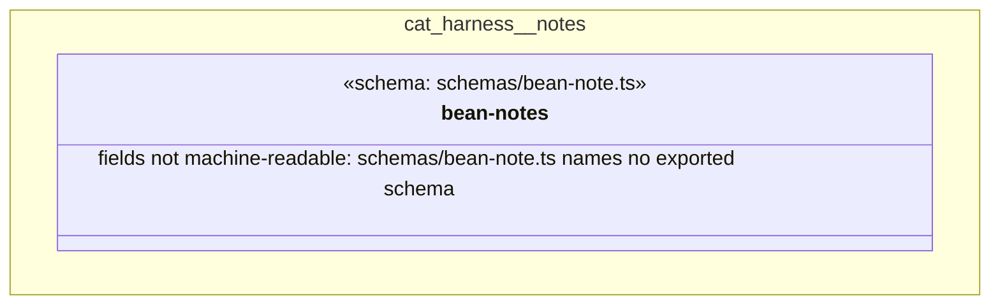

# UML — cat-harness/notes

Generated by `cat-harness/scripts/gen-uml-overview.ts` — do not edit. The `notes` sub-graph of `cat-harness` (`cat-harness/beans/notes`), with every attribute read from its node schema.

**Sources (same model):** [PlantUML](https://github.com/litlfred/folio-assistant/blob/main/cat-harness/uml/overview/cat-harness/notes.puml) · [Mermaid](https://github.com/litlfred/folio-assistant/blob/main/cat-harness/uml/overview/cat-harness/notes.mmd)

  <fieldset class="fa-uml-view-pick">
    <legend>Layout</legend>
    <input type="radio" name="fa-uml-overview_cat_harness_notes" id="fa-uml-overview_cat_harness_notes-portrait" class="fa-uml-pick-portrait" checked><label for="fa-uml-overview_cat_harness_notes-portrait">Portrait</label>
    <input type="radio" name="fa-uml-overview_cat_harness_notes" id="fa-uml-overview_cat_harness_notes-landscape" class="fa-uml-pick-landscape"><label for="fa-uml-overview_cat_harness_notes-landscape">Landscape</label>
  </fieldset>
  <figure class="bpmn-figure fa-uml-portrait">
    
  </figure>
  <figure class="bpmn-figure fa-uml-landscape">
    
  </figure>

| sub-graph | directory | graph typologies | node schema | nodes | cohesion | in | out |
|---|---|---|---|---|---|---|---|
| `cat-harness/notes` | `cat-harness/beans/notes` | bean-notes | `schema: schemas/bean-note.ts` | *not measured* | | | |

*Nodes, cohesion, in and out* are the detangler's pinned measurements for the same directory (`bun run cat kg:detangle`; skill [`graph-detanglement`](https://github.com/litlfred/folio-assistant/blob/main/cat-harness/skills/kg/graph-management/graph-detanglement.md)). *Not measured* means the detangler does not scan that directory, not that it has no edges.

## Sub-graphs

- [← all of cat-harness](../cat-harness.html)

## The same model, drawn by Mermaid

Kept so the page renders even where the PlantUML image is missing, and because Mermaid nodes carry the CSS class that colours them from `uml.css`.

